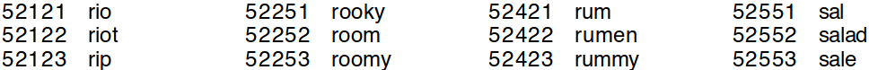

# Les mots de passe

### Quels sont les risques?

La compromission d’un mot de passe est susceptible d’engendrer une **usurpation de votre identité ainsi que l’accès aux données** protégées par l’identification.

### Le pire des systèmes à l'exclusion de tous les autres

Aussi répandus soient-ils **les mots de passe n’ont jamais été considérés comme des modes d’authentification satisfaisants** : l’imagination (pour créer des mots de passe) et la mémoire (pour s’en souvenir) ne sont pas des qualités innées aux humains[1].

Pour saisir pourquoi le caractère aléatoire et la longueur d’un mot de passe sont essentiels il faut comprendre comment les mots de passe peuvent être “crackés”.

### Comment les mots de passe sont "crackés ?

Le plus souvent les mots de passe sont obtenus depuis un serveur auquel un attaquant a d’abord pu accéder. En principe les mots de passe ne sont jamais stockés “en clair” sur le serveur : seule leur empreinte cryptographique* est enregistrée.

Pour déduire le mot de passe en clair qui correspond à une empreinte l’attaquant va hasher un grand nombre de mots de passe potentiels et vérifier à chaque fois si cette empreinte est identique à celles qu’il a obtenus sur le site victime.

Cette méthode d’attaque par force brute consiste donc à essayer, une à une, toutes les combinaisons possibles pour un mot de passe. C’est l’équivalent, pour le code d’un coffre-fort à 4 chiffres, de la tentative successive de tous les nombres compris entre 0000 et 9999.

Plus le mot de passe est long et composé de caractères variés plus il faut de temps pour obtenir le bon mot de passe. Et chaque caractère supplémentaire augmente de manière exponentielle le temps nécessaire.

Mais l’imagination des internautes étant limitées, les attaquants préfèrent aujourd’hui recourir à une **attaque par dictionnaire**. L’ordinateur ne va pas essayer toutes les combinaisons possibles au hasard (cela serait beaucoup trop long) mais se fonder sur des listes préconstituées (appelées *dictionnaires*) qui regroupent aussi bien les couleurs, noms et prénoms les plus courants, les mots du dictionnaire ou les mots de passe issus de fuites de données. Si un attaquant cherche à obtenir le mot de passe d’un fleuriste, il intégrera à son dictionnaire tout le lexique botanique.

> !! Certains sites web vous proposent de vérifier la sécurité de votre mot de passe. Pour vérifier la force d’un mot de passe le site web a donc nécessairement accès à votre mot de passe.
> 
> Nous déconseillons très fortement l’utilisation de ce genre de services qui ne sont souvent qu’un moyen frauduleux d’obtenir de nombreux mots de passe en cours d’usage et, éventuellement, d’obtenir également votre adresse mail en contrepartie d’une newsletter.
> 
> Le seul service digne de confiance est “Have I Been Pwned ?” de Troy Hunt, qui permet de vérifier que le mot de passe utilisé ne se trouve pas dans une précédente fuite de données.

### Ce qui fait un bon mot de passe

Récapitulons : un bon mot de passe doit être suffisamment long (15 caractères minimum) et composé aléatoirement de différents types de caractères.

Un bon mot de passe ne ressemble donc pas à `Jacquesdu75` mais plutôt à `~!y#w~zAtZt"WlY7pNo8`. À l’évidence les bons mots de passe sont difficiles à mémoriser, surtout s’il faut utiliser un mot de passe par site.

La solution recommandée est d’**utiliser un gestionnaire de mot de passe** (recommandation 1), c’est-à-dire un logiciel qui s’occupe aussi bien de générer des mots de passe aléatoires pour chaque site que de les enregistrer en mémoire pour y accéder rapidement. Cette méthode augmente sensiblement la qualité et la sécurité des mots de passe sans atténuer le workflow.

Il est généralement recommandé de renouveler régulièrement ses différents mots de passe. L’idée est que si un mot de passe de 8 caractères peut être cracké en 40 jours, alors changer ses mots de passe en 30 jours.

### L'authentification à plusieurs facteurs

## Recommandations

 * Utiliser un gestionnaire de mots de passe (*pratique n°1*)
 * Créer soi-même un mot de passe maître fort (*pratique n°2*)

## Pratiques

### 1. Génération manuelle d'une phrase de passe

La meilleure façon de générer un bon mot de passe dont il est facile de se souvenir est d’utiliser la méthode dite Diceware.

Arnold Reinhold, son créateur, a constitué une liste de 55 555 mots du dictionnaire anglais chacun identifié par un nombre à 5 chiffres (de 11 1111 à 66 666). 5 dés sont lancés et chacun des chiffres obtenus est combiné pour correspondre à un mot issu de la liste. 

[**1**]: Une note de bas de page

